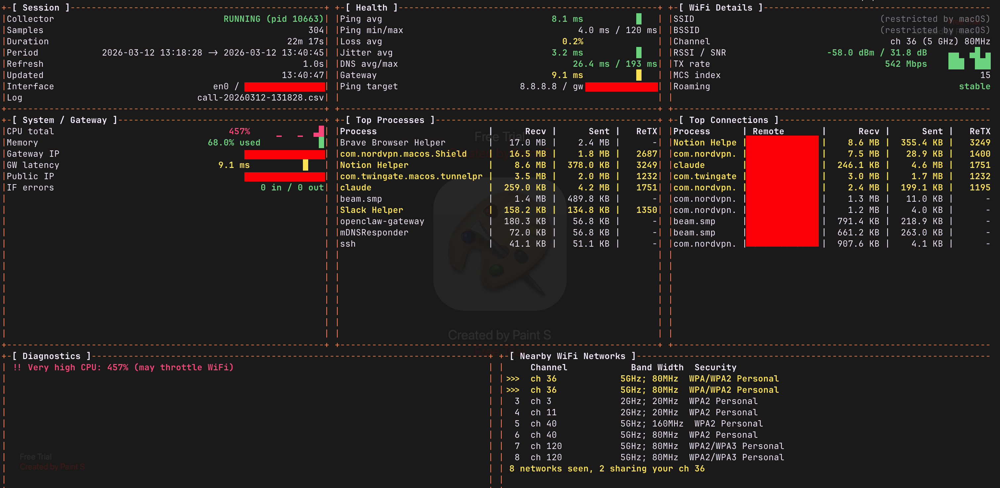

# netmon

**Real-time network diagnostics for macOS** — built to figure out why your WiFi drops during video calls.

Run it in the background during a Google Meet / Zoom / Teams call, then review the data to pinpoint whether the problem is your WiFi signal, a noisy channel, a bandwidth-hogging process, your ISP, or something else entirely.

```
./netmon.sh monitor
```


---

## What it collects

Every 2 seconds (configurable), netmon samples **27 metrics** across 4 CSV log files:

| Category                   | Metrics                                                                 |
| -------------------------- | ----------------------------------------------------------------------- |
| **WiFi signal**            | RSSI, noise floor, SNR, TX rate, MCS index, channel, band, width, BSSID |
| **Latency**                | Ping (min/avg/max), jitter (mean absolute deviation), packet loss       |
| **Gateway**                | Gateway IP, gateway ping (isolates WiFi vs ISP problems)                |
| **DNS**                    | DNS lookup latency                                                      |
| **Network**                | Interface, local IP, public IP, interface errors (in/out)               |
| **System**                 | CPU usage, memory pressure                                              |
| **Per-process traffic**    | Bytes in/out, rx duplicates, out-of-order packets, TCP retransmits      |
| **Per-connection traffic** | Remote IP, port, bytes in/out, retransmits — per TCP socket             |
| **WiFi environment**       | Nearby networks scan — channel, band, width, security, signal strength  |

## Live TUI dashboard

The `monitor` command launches a full-screen curses dashboard with 6 panels:



- **Sparklines** show metric trends over time
- **Color-coded values** — green/yellow/red based on severity thresholds
- **Diagnostics engine** runs 15+ checks every refresh and highlights problems
- **Channel congestion** markers (`>>>`) flag networks sharing your channel

## Quick start

### Requirements

- **macOS** (uses macOS-specific tools: `system_profiler`, CoreWLAN, `nettop`, `vm_stat`)
- **Python 3** (ships with macOS or install via Homebrew)
- **No other dependencies** — pure bash + Python standard library

### Usage

```bash
# All-in-one: start collector + open live dashboard
./netmon.sh monitor

# Or run collector and dashboard separately
./netmon.sh start          # start background collector
./netmon.sh monitor --attach   # attach TUI to running collector

# Stop monitoring
./netmon.sh stop

# Review a completed session
./netmon.sh review

# List all saved sessions
./netmon.sh list

# One-shot throughput measurement
./netmon.sh measure --duration 30
```

Press `q` to quit the TUI. The collector stops automatically unless you pass `--keep-running`.

### Recommended: enable Location Services

macOS Sequoia restricts SSID and BSSID access. To see your network name and access point:

**System Settings → Privacy & Security → Location Services → enable for your terminal app** (Terminal.app, iTerm2, etc.)

Without this, WiFi monitoring still works — you'll just see `(restricted by macOS)` for SSID/BSSID.

## Commands

| Command                  | Description                                                   |
| ------------------------ | ------------------------------------------------------------- |
| `start`                  | Start the background collector daemon                         |
| `stop`                   | Stop the collector and print session summary                  |
| `monitor`                | Start collector + live TUI (or attach to existing)            |
| `monitor --attach`       | Attach TUI to an already-running collector                    |
| `monitor --keep-running` | Keep collector running after quitting TUI                     |
| `measure`                | Measure interface throughput over a time window               |
| `review [file]`          | Print a post-session report for the latest (or specified) log |
| `list`                   | List all saved log sessions                                   |

## Configuration

All settings via environment variables:

```bash
MONITOR_INTERVAL=2       # Seconds between samples (default: 2)
PING_TARGET=8.8.8.8      # Host to ping (default: 8.8.8.8)
PING_COUNT=3             # Pings per sample (default: 3)
PING_TIMEOUT_MS=2000     # Ping timeout in ms (default: 2000)

# Example: faster sampling, ping Cloudflare instead
MONITOR_INTERVAL=1 PING_TARGET=1.1.1.1 ./netmon.sh monitor
```

## Log files

All data is saved to `~/call-network-logs/` as plain CSV:

```
~/call-network-logs/
├── call-20260312-143022.csv              # Main metrics (27 columns)
├── call-20260312-143022-traffic.csv      # Per-process traffic deltas
├── call-20260312-143022-connections.csv  # Per-connection traffic deltas
└── call-20260312-143022-scan.csv         # WiFi environment scans
```

CSV files are easy to import into spreadsheets, pandas, or any analysis tool for deeper investigation.

## Diagnostics

The TUI runs these checks continuously:

| Check                 | Triggers                                               |
| --------------------- | ------------------------------------------------------ |
| Weak WiFi signal      | RSSI below -67 dBm (warn) or -75 dBm (critical)        |
| Low SNR               | Signal-to-noise ratio below 20 dB                      |
| High latency          | Ping above 50 ms (warn) or 100 ms (critical)           |
| High jitter           | Above 10 ms (warn) or 30 ms (critical for video calls) |
| Packet loss           | Any loss in recent samples                             |
| WiFi vs ISP isolation | Compares gateway latency to internet latency           |
| Slow DNS              | Above 80 ms (warn) or 200 ms (critical)                |
| Low TX rate           | Below 100 Mbps (warn) or 50 Mbps (critical)            |
| 2.4 GHz band          | Warns if not on faster 5 GHz                           |
| AP roaming            | Detects BSSID changes (switching access points)        |
| Channel changes       | Detects channel hops                                   |
| Interface errors      | Input/output errors on the network interface           |
| CPU pressure          | Above 200% (warn) or 400% (critical)                   |
| Memory pressure       | Above 80% (warn) or 90% (critical)                     |
| Channel congestion    | Other networks on the same WiFi channel                |

## How it works

1. **Collector** (`netmon.sh`) runs as a background process, sampling every N seconds
2. WiFi info is read via a **CoreWLAN Swift helper** (compiled on first run) or the legacy `airport` tool
3. Ping, DNS lookup, and gateway ping run **in parallel** to minimize sample time
4. Per-process and per-connection traffic is captured via `nettop` with delta computation
5. WiFi environment scan runs via `system_profiler SPAirPortDataType` every 15 cycles
6. **TUI** (`netmon_tui.py`) reads the CSV files and refreshes every second
7. The monitor is resilient to network switches — transient failures don't crash the collector

## Tests

```bash
# Python unit tests — helpers, CSV parsing, diagnostics, thresholds (182 tests, <1s)
uv run pytest tests/

# Bash parser tests — parse_ping, parse_wifi_info, sanitize_csv_field, etc. (46 tests)
bash tests/test_bash_parsers.sh

# Integration test — starts a real collector, validates CSV output and
# runs the full pipeline: collector → CSV → Python parser → diagnostics (~20s)
bash tests/test_collector_integration.sh
```

## License

MIT
